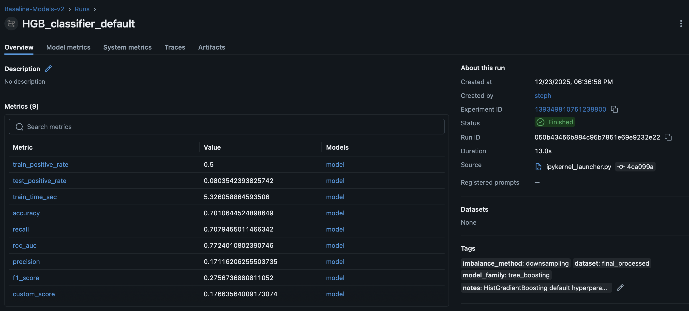

# OCR Projet 06 – Crédit

[](https://github.com/stephmnt/OCR_Projet05/actions/workflows/deploy.yml)
[](https://github.com/stephmnt/OCR_Projet06/releases)
[](https://github.com/stephmnt/OCR_Projet06/blob/main/LICENSE)

## Lancer MLFlow

Le notebook est configure pour utiliser un serveur MLflow local (`http://127.0.0.1:5000`).
Pour voir les runs et creer l'experiment, demarrer le serveur avec le meme backend :

```shell
mlflow server \
  --host 127.0.0.1 \
  --port 5000 \
  --backend-store-uri "file:${PWD}/mlruns" \
  --default-artifact-root "file:${PWD}/mlruns"
```

Seulement l'interface (sans API), lancer :

```shell
mlflow ui --backend-store-uri "file:${PWD}/mlruns" --port 5000
```

Pour tester le serving du modele en staging :

```shell
mlflow models serve -m "models:/credit_scoring_model/Staging" -p 5001 --no-conda
```

## Contenu de la release

### Ce qui est conforme (livrables couverts)

- **Preparation + pipeline** : nettoyage / preparation, encodage, imputation et pipeline d'entrainement presentes.
- **Gestion du desequilibre** : un sous-echantillonnage est applique sur le jeu d'entrainement final.
- **Comparaison multi-modeles** : baseline, Naive Bayes, Logistic Regression, Decision Tree, Random Forest,
  HistGradientBoosting, LGBM, XGB sont compares.
- **Validation croisee + tuning** : `StratifiedKFold`, `GridSearchCV` et Hyperopt sont utilises.
- **Score metier + seuil optimal** : le `custom_score` est la metrique principale des tableaux de comparaison
  et de la CV, avec un `best_threshold` calcule.
- **Explicabilite** : feature importance, SHAP et LIME sont inclus.
- **MLOps (MLflow)** : tracking des params / metriques (dont `custom_score` et `best_threshold`), tags,
  registry et passage en "Staging".



### Glossaire rapide (pour debutant)

- **custom_score** : metrique metier qui penalise plus fortement les faux negatifs que les faux positifs.
- **Seuil optimal** : probabilite qui sert a transformer un score en classe 0/1.
- **Validation croisee (CV)** : evaluation sur plusieurs sous-echantillons pour eviter un resultat "chanceux".
- **MLflow tracking** : historique des runs, parametres et metriques.
- **Registry** : espace MLflow pour versionner et promouvoir un modele (ex. "Staging").
